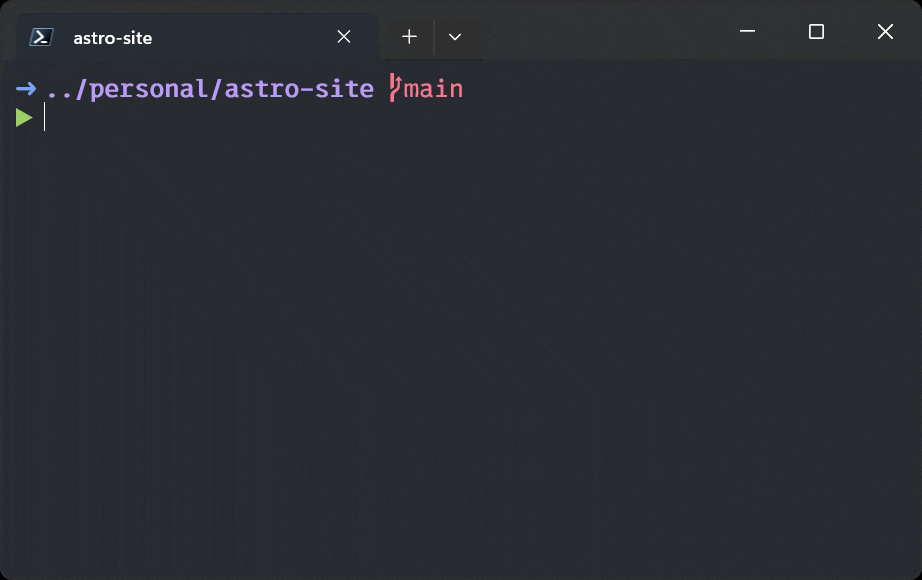
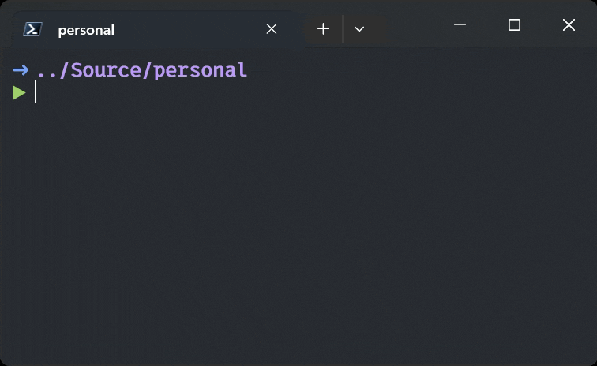

You don't have to struggle around your terminal, it's yours to customise how you like. I've grown to really enjoy using Windows Terminal with PowerShell 7. At the start of my career, I rarely used the command line, I couldn't remember the commands, I found it difficult to get to where I wanted, and I couldn't see how any of this could possibly be faster than using GUIs.


However a few years ago I came across three blog posts by Scott Hanselman which completely changed my experience:
* [Oh My Posh Prompt Customisation](https://www.hanselman.com/blog/my-ultimate-powershell-prompt-with-oh-my-posh-and-the-windows-terminal)
* [Predictive Intellisense with PSReadLine](https://www.hanselman.com/blog/adding-predictive-intellisense-to-my-windows-terminal-powershell-prompt-with-psreadline)
* [Spend less time cding around directories with the PowerShell Z Shortcut](https://www.hanselman.com/blog/spend-less-time-cding-around-directories-with-the-powershell-z-shortcut)


If you haven't read these, I highly recommend you do.
After implementing the things outlined in Scott's posts my experience in the terminal changed completely. I finally became productive with the terminal, and it completely changed my development set up as a Software Engineer. I realised *my* terminal experience was mine to own. So I started owning it, and if you're not owning yours yet, I recommend you start. Here's how:

## Modifying PowerShell Profile

The easiest way to do this is to run `code $PROFILE` in PowerShell. This will open your PowerShell Profile in VS Code.

## Start Simple - Alias everything

The best way to start is to find common commands, common applications, and difficult to remember commands. In general if I can have 1-3 characters to do the command, I would much rather do that.

### Launching Applications Quickly
A lot of applications that are launched from the command line will recommend an alias. For example:
```powershell
Set-Alias lg lazygit # run lazygit  (https://github.com/jesseduffield/lazygit)
Set-Alias ld lazydocker # run lazydocker (https://github.com/jesseduffield/lazydocker)
```

### Launch Your Own Tools

Create an alias to launch tools you've made for yourself that don't have a proper installer.
```powershell
Set-Alias subs "C:\Source\personal\az-subscriptions-tui\Az.Subscriptions\bin\Release\net8.0\Az.Subscriptions.exe"
```
Launches a [TUI I made](https://github.com/ruairica/az-subscriptions-tui) to change Azure Subscriptions

### Streamline Combinations
```powershell
function GoToRepos {
    Clear-Host
    Set-Location 'C:/Source'
    Get-ChildItem
}

function Mkcd {
    mkdir @args && Set-Location @args
}

Set-Alias repos GoToRepos # clear the console, move the current working directory to `C:/Source`, show all the directories in it
Set-Alias mkcd Mkcd # combination of mkdir and cd
```

### Difficult To Remember Combinations

I was forever forgetting this command, `usr` is much less of a chore to recall.
```powershell
function UserSecretsRetrieve {
    dotnet user-secrets-retriever retrieve @args
}

Set-Alias usr UserSecretsRetrieve
```

### Why not ?

I go as far as aliasing commands that aren't even long or hard to rememeber, but I just use them so often I think it's worth it.


```powershell
function OpenExplorerHere {
    explorer .
}

function Start-VsCodeHere {
    code .
}

function DotnetFormat {
    dotnet format @args
}

Set-Alias e OpenExplorerHere # Open file explorer
Set-Alias c Start-VsCodeHere # Open VS Code
Set-Alias df DotnetFormat # Run dotnet format
```

## Adding Complexity

This function combines fzf (command line fuzzy finder - `winget install junegunn.fzf`) and ripgrep (a faster grep - `winget install BurntSushi.ripgrep.MSVC`) to fuzzy-find specific text across all files recursively from the current directory, it then opens the file in VS Code. Common usage `fg randomfunctionnameiknowiusedsomewherebutcantrememberwhere`

```powershell
function frg {
    $result = rg --ignore-case --color=always --line-number --no-heading @Args |
    fzf --ansi `
        --color 'hl:-1:underline,hl+:-1:underline:reverse' `
        --delimiter ':' `
        --preview-window 'up,60%,border-bottom,+{2}+3/3,~3'

    if ($result) {
        & code ($result -split ":", 2)[0]
    }
}

Set-Alias fg frg
```



Using fzf again to pick a directory and move into it
```powershell
function fcd {
    $result = Get-ChildItem -Directory | ForEach-Object { $_.Name } |
    fzf --preview 'dir /b {}'
    if ($result) {
        Set-Location $result
    }
}

Set-Alias fd fcd
```


I hope this gets you thinking about what else you could be adding to your $PROFILE to optimise your current terminal experience.


My current PowerShell $PROFILE can be found [here](https://github.com/ruairica/settings/blob/main/powershell/profile.ps1). I don't always keep it up to date on Github but it does get added to regularly.